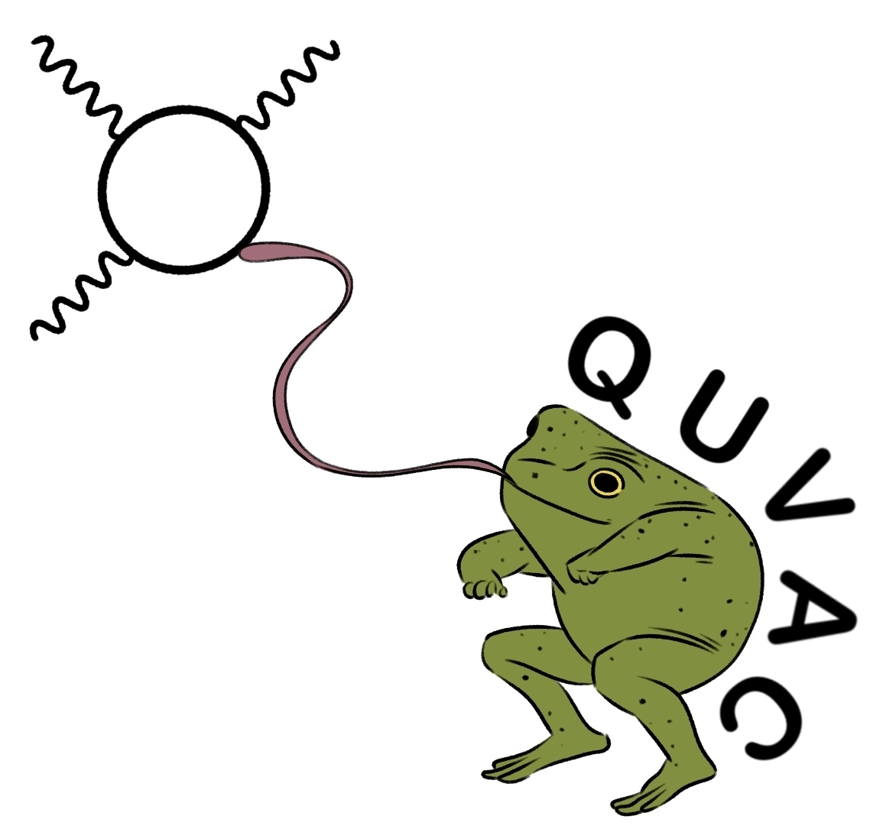

# quvac




Quvac (from quantum vacuum, pronounced as qu-ack 🐸) allows to calculate quantum vacuum signals produced during light-by-light scattering.

Documentation is available [here](https://maxbalrog.github.io/quvac/).

> [!IMPORTANT]
> This project is still in development!

## Installation

It is recommended to create a separate Python environment for this package, e.g.

```bash
micromamba create -n quvac python=3.12
```

After cloning the git repository and entering it, choose relevant optional dependencies

- `[test]` allows to run tests
- `[plot]` installs `matplotlib` and `jupyterlab`
- `[docs]` installs `sphinx` and everything necessary for documentation generation
- `[optimization]` installs Bayesian optimization package
- `[light]` is a shorthand for `[test,plot,docs]`

To install all dependencies, run

```bash
pip install .[all]
```

> [!NOTE]
> For example, if you do not require optimization capabilities, run
> 
> ```bash
> pip install .[test,plot]
> ```

After successfull installation with `[all]` or `[test]` option, run ``pytest`` to make sure the installation was
successfull (it takes some time).

```bash
pytest
```

### Using `uv`

If you prefer using `uv` package manager then the installation follows similar steps. After cloning the git repository and entering 
it, create the environment and install `quvac`

```bash
uv venv
uv pip install .[light]
```

You can test the installation with

```bash
uv run pytest
```

Launch the jupyterlab (e.g. tutorial notebooks) with

```bash
uv run jupyter lab
```

Generate the documentation with

```bash
uv run python -m sphinx -b html docs/source docs/build/html
```

## Contribution

If you noticed a bug or have a feature request, open a new [issue](https://github.com/maxbalrog/quvac/issues).

## Acknowledgements

If you use this code and/or consider it useful, please cite our article.

```bibtex
@article{valialshchikov2025back,
  title={Back-reflection in dipole fields and beyond},
  author={Valialshchikov, Maksim and Karbstein, Felix and Seipt, Daniel and Zepf, Matt},
  journal={arXiv preprint arXiv:2510.11764},
  year={2025}
}
```

## References

[1] - F. Karbstein, and R. Shaisultanov. "Stimulated photon emission from the vacuum." PRD 91.11 (2015): 113002 [[article]](https://arxiv.org/abs/1412.6050).

[2] - A. Blinne, et al. "All-optical signatures of quantum vacuum nonlinearities in generic laser fields." PRD 99.1 (2019): 016006 [[article]](https://arxiv.org/abs/1811.08895).
